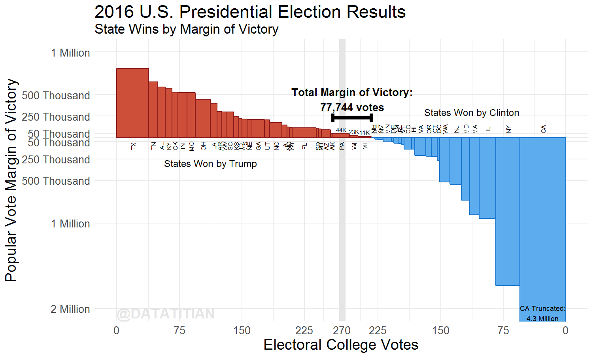

This is a visualization of how the U.S. Electoral College System effected the margin of victory, 
or minumum number of votes that it would have taken to change the election outcome, for the 2016 Presidential Election.

Election results data are scraped from 
[United States presidential election, 2016 (Wikipedia)](https://en.wikipedia.org/wiki/United_States_presidential_election,_2016)

A discussion of the results is available on my blog, [The Datatitian: Filibuster Gorsuch](http://datatitian.com/filibuster-gorsuch/)

[View the R Notebook for my analysis](http://wmurphyrd.github.io/presidential-margin-2016/scvote.nb.html)
